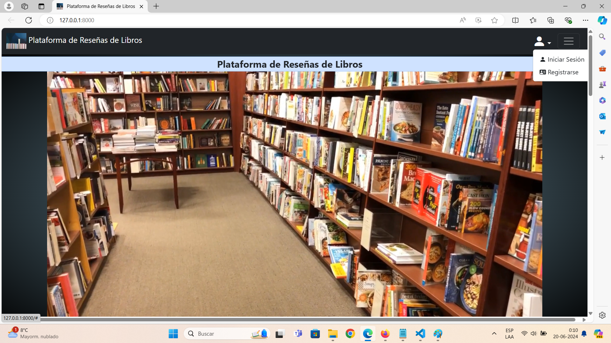
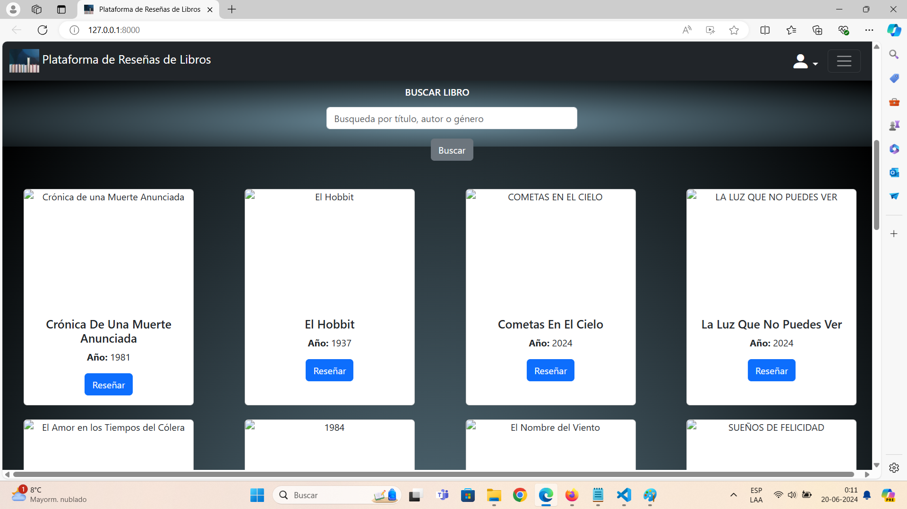
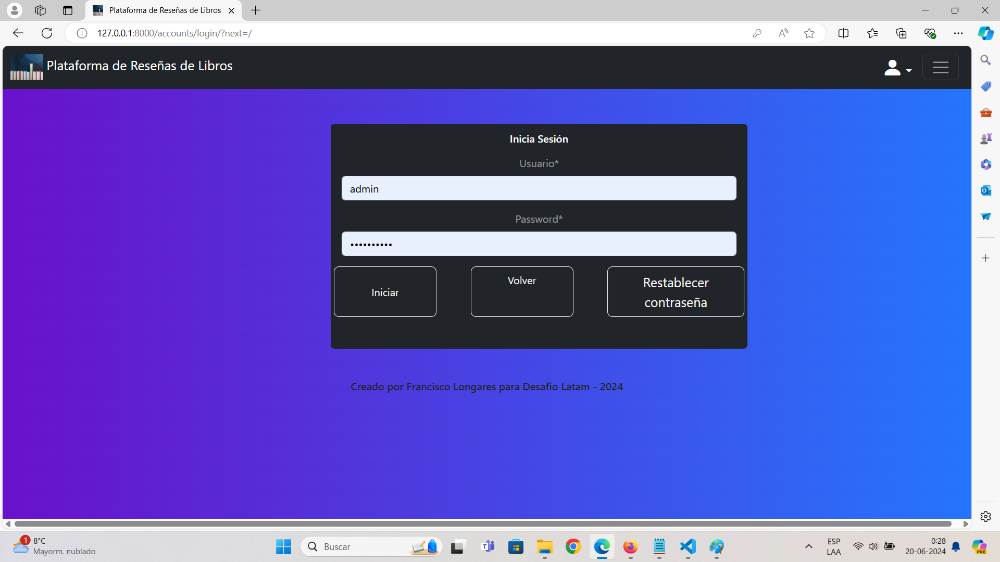

# Titulo del proyecto

Plataforma de Reseñas de Libros


## Descripción del proyecto

Aplicación para reseñar las opciones de los lectores acerca de los libros.

## Capturas de Pantalla del Proyecto

Incluir capturas de pantalla o imágenes que muestren el proyecto en funcionamiento.


Captura Home

Captura search gallery

Captura Inicio sesion

Captura reseña de libros

Captura contact form

Captura navbar

Captura registro de libros

## Prerrequisitos o Dependencias

Lista de software y herramientas, incluyendo versiones, que necesitas para instalar y ejecutar este proyecto:

- Sistema Operativo Windows 11
- Lenguaje de programación  Python 3.12.11
- Framework  Django 5.0.6
- Base de datos PostgreSQL 16
- Library: crispy-bootstrap5==2024.2, django-crispy-forms==2.1, psycopg==3.1.18, sqlparse==0.5.0, typing_extensions==4.11.0, tzdata==2024.1, asgiref==3.8.1, django-environ==0.11.2

## Instalación del Proyecto

Una guía paso a paso sobre cómo configurar el entorno de desarrollo e instalar todas las dependencias.

```bash
# paso 1
```
- Clone the repository using Git.

```bash
# paso 2
```
- pip install virtualenv, django, django-environ, Pillow
- pip install -r requirements-resena_libros.txt

## Instrucciones para Ejecutar el Proyecto

Instrucciones para ejecutar el proyecto una vez instalado.


```bash
# paso 1
```
- cd .venv
- cd Scripts
- .\activate
- cd..
- cd..
- cd resena_libros
- python .\manage.py runserver
- Starting development server at http://127.0.0.1:8000/

## Instrucciones para Cargar la Base de Datos o Migrar los Modelos

```bash
# paso 1
```
- config settings.py
- DATABASES = {
-     'default': {
-         'ENGINE': 'django.db.backends.postgresql',
-         'NAME': env('DB_NAME'),
-         'USER': env('DB_USER'),
-         'PASSWORD': env('DB_PASSWORD'),
-         'HOST': env('DB_HOST'),
-         'PORT': env('DB_PORT'),
-     }
- }
- python manage.py makemigrations
- python manage.py migrate

- Cargar Base de datos
- python manage.py loaddata resena_libros.json

## Credenciales de Acceso

### Para Usuario Tipo Administrador

- admin
- Contraseña: Prueba12

### Para Usuario 

- Francisco
- Contraseña: Prueba12

## Autor

- [Francisco Longares](https://github.com/longaresf)
